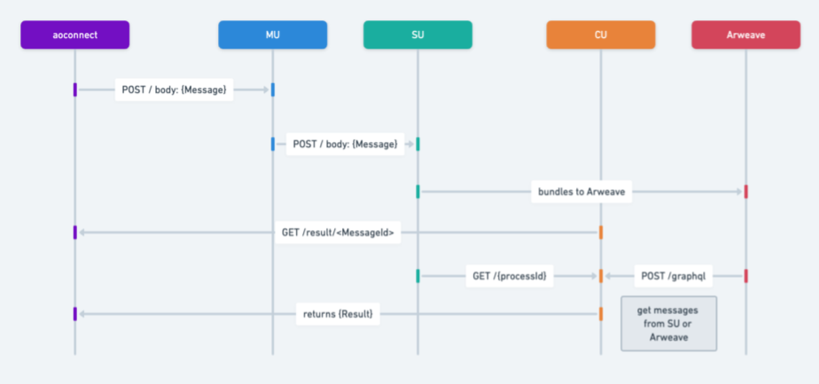

# Messages

ao Messages is the data protocol of ao, messages are designed from ANS-104 DataItems, so they are native to Arweave. The structure of a message when interacting in a ao Process looks like the following:

```lua
{
    Cron = false,
    Data = "Hello aos",
    Epoch = 0,
    From = "5WzR7rJCuqCKEq02WUPhTjwnzllLjGu6SA7qhYpcKRs",
    Id = "ayVo53qvZswpvxLlhMf8xmGjwxN0LGuHzzQpTLT0_do",
    Nonce = 1,
    Owner = "z1pq2WzmaYnfDwvEFgUZBj48anUsxxN64ZjbWOsIn08",
    Signature = "...",
    Tags = {
        Type = "Message",
        Variant = "ao.TN.1",
        ["Data-Protocol"] = "ao",
        ["From-Module"] = "lXfdCypsU3BpYTWvupgTioLoZAEOZL2_Ihcqepz6RiQ",
        ["From-Process"] = "5WzR7rJCuqCKEq02WUPhTjwnzllLjGu6SA7qhYpcKRs"
    },
    Target = "5WzR7rJCuqCKEq02WUPhTjwnzllLjGu6SA7qhYpcKRs",
    Timestamp = 1704936415711,
    ["Block-Height"] = 1340762,
    ["Forwarded-By"] = "z1pq2WzmaYnfDwvEFgUZBj48anUsxxN64ZjbWOsIn08",
    ["Hash-Chain"] = "hJ0B-0yxKxeL3IIfaIIF7Yr6bFLG2vQayaF8G0EpjbY"
}
```

When sending a message, here is a visual diagram of how the messages travels through the ao computer.



The message is posted to the MU (Messenger Unit), which verifies it is signed and sends it to the SU (Scheduler Unit), which assigns an Epoch and Nonce, and bundles the Message and publishes it to Arweave. Then the `aoconnect` library, reads the result from the CU (Compute Unit), the CU requests all the Messages up to this Message Id and evaluates them in the Compute Unit to calcuate the Result. Once evaluated it sends the Result Response to aoconnect, which is embedded in clients like `aos`.

In the CU (Compute Unit) is where the Processes reside, lets learn more about processes.

## Summary

Messages serve as the primary data protocol type for the ao network, leveraging ANS-104 Data-Items native to Arweave. Messages contain several fields including data content, origin, target, and cryptographic elements like signatures and nonces. They follow a journey starting at the Messenger Unit (MU), which ensures they are signed, through the Scheduler Unit (SU) that timestamps and sequences them, before being bundled and published to Arweave. The `aoconnect` library then reads the result from the Compute Unit (CU), which processes messages to calculate results and sends responses back through `aoconnect`, utilized by clients such as `aos`. The CU is the execution environment for these processes.
