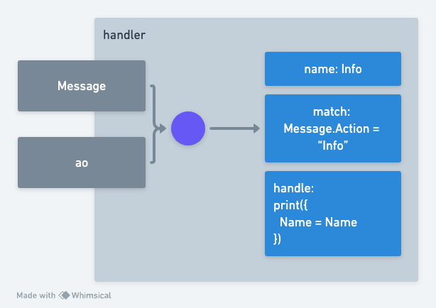

# Processes

Processes possess the capability to engage in communication via message passing, both receiving and dispatching messages within the network. Additionally, they hold the potential to instantiate further processes, enhancing the network's computational fabric. This dynamic method of data dissemination and interaction within the network is referred to as a 'holographic state,' underpinning the shared and persistent state of the network.


When building a Process with `aos` you have the ability to add `handlers`, these handlers can be added by calling the `Handlers.add` function, passing a "name", a "match" function, and a "handle" function.



The core module contains a helper library that gets injected into the handler function, this library is called `ao`.

```lua
{
    env = {
        Process = {
            Id = "5WzR7rJCuqCKEq02WUPhTjwnzllLjGu6SA7qhYpcKRs",
            Owner = "_r9LpP4FtClpsGX3TOohubyaeb0IQTZZMcxQ24tTsGo",
            Tags = {...}
        },
        Module = {
            Id = "UAUszdznoUPQvXRbrFuIIH6J0N_LnJ1h4Trej28UgrE",
            Owner = "_r9LpP4FtClpsGX3TOohubyaeb0IQTZZMcxQ24tTsGo",
            Tags = {..}
        }
    },
    id = "5WzR7rJCuqCKEq02WUPhTjwnzllLjGu6SA7qhYpcKRs",
    isTrusted = "function: 0x5468d0",
    result = "function: 0x547120",
    send = "function: 0x547618",
    spawn = "function: 0x5468b0"
}
```

The main functions to look at in this `ao` helper is

- ao.send(Message) - sends a message to a process
- ao.spawn(Module, Message) - creates a new process

## ao.send Example

```lua
ao.send({
    Target = Chatroom,
    Action = "Broadcast",
    Data = "Hello from my Process!"
})
```

## ao.spawn Example

```lua
ao.spawn(ao.env.Module.Id, {
    ['Memory-Limit'] = "500-mb",
    ['Compute-Limit"] = "900000000000000000"
})
```

## ao.env

> NOTE: `ao.env` is important context data that you may need as a developer creating processes.

The `ao.env` property contains the `Process` and `Module` Reference Objects

```
env = {
    Process = {
        Id = "5WzR7rJCuqCKEq02WUPhTjwnzllLjGu6SA7qhYpcKRs",
        Owner = "_r9LpP4FtClpsGX3TOohubyaeb0IQTZZMcxQ24tTsGo",
        Tags = {...}
    },
    Module = {
        Id = "UAUszdznoUPQvXRbrFuIIH6J0N_LnJ1h4Trej28UgrE",
        Owner = "_r9LpP4FtClpsGX3TOohubyaeb0IQTZZMcxQ24tTsGo",
        Tags = {..}
    }
}
```

Both the `Process` and the `Module` contain the attributes of the `ao` Data-Protocol.

## Summary

Processes in the network communicate through message passing and can create new processes, contributing to a 'holographic state' of shared and persistent data. Developers can build a Process using `aos` by adding handlers through the `Handlers.add` function with specific name, match, and handle functions. The `ao` helper library within the core module aids in this process, providing functions like `ao.send` to dispatch messages and `ao.spawn` to create new modules, as well as the important `ao.env` property which contains essential Process and Module information. The `ao` Data-Protocol outlines the structure and attributes of these elements.
