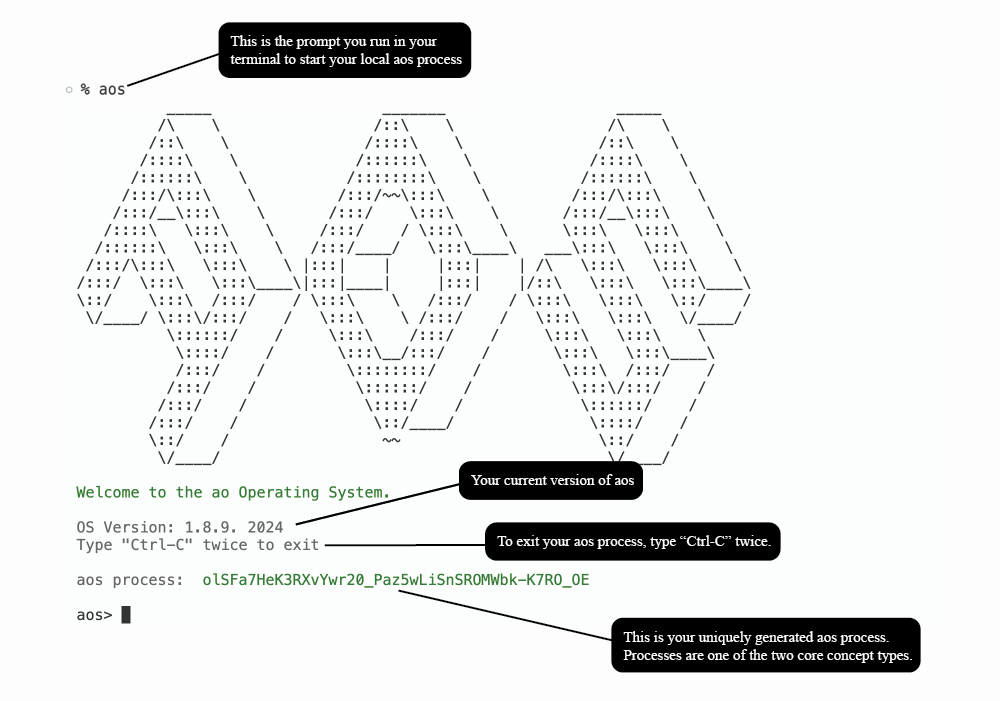

# 准备工作

::: info
**觉醒开始**

你一直都知道，这个世界上还有更多你无法企及的事情。 你一直在寻找它，甚至不知道你在寻找什么。 它就是... `ao`。

我们通过安装 `aos` 客户端并启动新进程来开始我们的旅程。 这将使我们能够与 ao 计算机进行交互并完成本教程的其余部分。

:::

## 视频教程

<iframe width="680" height="350" src="https://www.youtube.com/embed/nhMZup9uVBQ?si=Ex0W_G-PZA1I9rH8" title="YouTube video player" frameborder="0" allow="accelerometer; autoplay; clipboard-write; encrypted-media; gyroscope; picture-in-picture; web-share" allowfullscreen></iframe>

## 系统要求

aos 本地客户端安装非常简单。 只需确保你拥有：

- [NodeJS](https://nodejs.org) 版本 20+. (如果你还没安装，查看[此网页](https://nodejs.org/en/download/package-manager) 找到适用于你的系统的安装说明)。
- 一个称手的代码编辑器。

::: info
尽管不是必需的，但我们建议将 [ao 插件](../../references/editor-setup) 安装到你选择的文本编辑器中，以优化你使用 `aos` 的体验。
:::

## 安装 aos

一旦你的机器上安装了 NodeJS，你所需要做的就是安装 aos 并运行它：

```sh
npm i -g https://get_ao.g8way.io
```

安装完成后，我们运行命令即可启动一个新的 aos 进程！

```sh
aos
```

## 欢迎来到兔子洞

你刚刚启动的实用程序是本地客户端，它已准备好将消息中继到 ao 计算机内的新进程。

连接后，你应该看到以下内容：

```sh
          _____                   _______                   _____
         /\    \                 /::\    \                 /\    \
        /::\    \               /:::\    \               /::\    \
       /:::\    \             /::::\    \             /:::\    \
      /::::\    \           /::::::\    \           /::::\    \
     /::/\::\    \         /::/~~\::\    \         /::/\::\    \
    /::/__\::\    \       /::/    \::\    \       /::/__\::\    \
   /:::\   \::\    \     /::/    / \::\    \      \::\   \::\    \
  /::::\   \::\    \   /::/____/   \::\____\   ___\::\   \::\    \
 /::/\::\   \::\    \ |::|    |     |::|    | /\   \::\   \::\    \
/::/  \::\   \::\____\|::|____|     |::|    |/::\   \::\   \::\____\
\::/    \::\  /::/    / \::\    \   /::/    / \::\   \::\   \::/    /
 \/____/ \::\/::/    /   \::\    \ /::/    /   \::\   \::\   \/____/
          \::::/    /     \::\    /::/    /     \::\   \::\    \
           \:::/    /       \::\__/::/    /       \::\   \::\____\
           /::/    /         \::::::/    /         \::\  /::/    /
          /::/    /           \::::/    /           \::\/::/    /
         /::/    /             \:::/    /             \::::/    /
        /::/    /               \::/____/               \:::/    /
        \::/    /                 ~~                      \::/    /
         \/____/                                           \/____/

ao Operating System

aos - 1.8.9
2024 - Type ".exit" to exit
aos process:  1xM1_lDZ428sJHpTX7rtcR6SrDubyRVO06JEEWs_eWo

aos>
```

让我们看一下运行 `aos` 后的初始打印输出：



在终端中运行 `aos` 后，你应该看到：

- `AOS` 的 ASCII 艺术图像。
- 一条欢迎信息。
- 你正在运行的 `aos` 版本。
- 一条退出的指令说明。
- 你的进程 ID。

::: info
如果你的操作系统版本与最新版本不同，则会出现一条消息，询问你是否要更新版本。 此时，只需按两次 `Ctrl+C` 退出进程，运行 `npm i -g https://get_ao.g8way.io` 进行更新，然后再次运行 `aos`。
:::

欢迎来到你在 ao 计算机的新家！ 你现在看到的提示是你在这台去中心化机器中自己的个人服务器。

现在，让我们通过探索 ao 的两个核心概念类型之一 [消息传递](messaging) 来进一步深入兔子洞。
